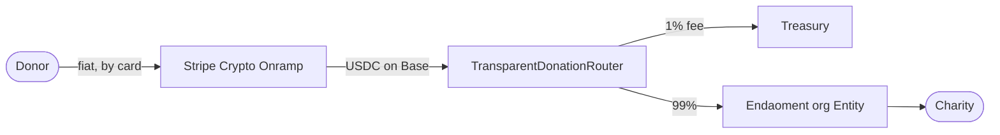

# Eudaimonia

A transparent, consumer-facing donation platform built on Base L2. Donors pay with a credit card; the money is converted to USDC on-chain, routed through an auditable smart contract, and delivered to vetted charities via [Endaoment](https://endaoment.org)'s decentralized philanthropy infrastructure. Every gift produces a public, verifiable receipt that traces the money from donor to charity — settlement, fees, and final delivery rendered as a shareable story.

The name comes from the Greek *εὐδαιμονία* (eudaimonia): human flourishing, the good life. The repository is named for a second Greek word, *φιλότιμο* (philotimo) — the sense of duty to do right by others.

## How it works



1. **Select** — the donor picks a curated, urgent cause on the landing page.
2. **Pay** — they enter an amount at `/donate/[campaignId]` and pay by card or Apple Pay. No wallet, no crypto knowledge required.
3. **On-ramp** — Stripe Crypto Onramp mints the fiat as USDC on Base; `/processing/[sessionId]` tracks the session as webhooks advance it toward settlement.
4. **Route** — the `TransparentDonationRouter` contract pulls the USDC, skims a hardcoded 1% platform fee to the treasury, and forwards the remaining 99% directly to the target charity's Endaoment org Entity.
5. **Prove** — `/receipt/[txid]` decodes the on-chain `DonationRouted` event into a visual timeline with real transaction IDs, linked to the block explorer.

## Trust model

The routing contract ([`contracts/src/TransparentDonationRouter.sol`](contracts/src/TransparentDonationRouter.sol)) is deliberately small and rigid:

- **Fee is hardcoded** — `FEE_BPS = 100` (1%) is a compile-time constant. No owner can raise it.
- **USDC and treasury are immutable** — set once at deploy, validated against the zero address, unchangeable afterward.
- **Destinations are allowlisted** — `donate` only forwards to org addresses the owner has vetted as legitimate Endaoment entities, so a valid `DonationRouted` log can never point at an attacker-controlled address. The owner key must be a multisig in production.
- **Checks-effects-interactions + `ReentrancyGuard`** on the donation path, with OpenZeppelin `SafeERC20` for transfers.

## Tech stack

| Layer | Technology |
|---|---|
| Frontend | Next.js 16 (App Router), React 19, Tailwind CSS 4, shadcn/ui |
| Web3 reads | viem + wagmi (receipt decoding, contract event reads) |
| Payments | Stripe Crypto Onramp (fiat → USDC on Base) |
| State/session | Vercel KV (Upstash Redis) with an in-memory fallback for dev |
| Contracts | Solidity 0.8.24, Foundry, OpenZeppelin |
| Network | Base mainnet / Base Sepolia (never Ethereum L1) |
| Observability | Sentry, Pino, Vercel Analytics |

## Repository layout

```
src/                  Next.js app
  app/                Routes: landing, donate/[campaignId], processing/[sessionId],
                      receipt/[txid], fee-policy, api/onramp (webhook + sessions)
  components/         UI components (shadcn/ui-based, Stripe-style design system)
  lib/                Domain logic: onramp state machine, receipt decoding,
                      campaigns, KV stores, rate limiting, env validation
contracts/            Foundry project
  src/                TransparentDonationRouter.sol + interfaces
  test/               Unit + fuzz tests, Base mainnet fork tests (test/fork/)
  script/             Deploy.s.sol (unit-tested deploy script)
docs/                 RUNBOOK.md (ops), DEPLOY-VERCEL.md, ADRs
prompts/              Persisted epic plans and operator action logs
e2e/                  Playwright end-to-end tests
```

Key documents: [`PRODUCT.md`](PRODUCT.md) (PRD), [`ARCHITECTURE.md`](ARCHITECTURE.md), [`DESIGN.md`](DESIGN.md) (design system), [`SECURITY.md`](SECURITY.md), [`docs/RUNBOOK.md`](docs/RUNBOOK.md) (webhook + router triage), [`contracts/DEPLOY.md`](contracts/DEPLOY.md) (router deployment).

## Getting started

Prerequisites: Node.js 20+, npm, and [Foundry](https://getfoundry.sh) (for contract work).

```bash
git clone https://github.com/mnkprs/Philotimo.git
cd Philotimo
npm ci

# Configure environment
cp .env.local.example .env.local
# Fill in Stripe keys, KV credentials, RPC URLs, and contract addresses.
# Defaults target Base Sepolia; public RPC endpoints work for development.

npm run dev
```

Open [http://localhost:3000](http://localhost:3000).

### Contracts

Foundry dependencies are vendored into `contracts/lib/` (not committed):

```bash
cd contracts
git clone --depth 1 --branch v1.9.6 https://github.com/foundry-rs/forge-std lib/forge-std
git clone --depth 1 --branch v5.1.0 https://github.com/OpenZeppelin/openzeppelin-contracts lib/openzeppelin-contracts
forge build
forge test
```

Fork tests in `contracts/test/fork/` run against a real Base mainnet fork and self-skip when `BASE_RPC_URL` / `ENDAOMENT_ORG` are not set, so the suite stays green without secrets:

```bash
BASE_RPC_URL=<your-base-rpc> ENDAOMENT_ORG=<org-entity-address> forge test --match-path 'test/fork/*'
```

Deployment to Base Sepolia or mainnet is an operator action — see [`contracts/DEPLOY.md`](contracts/DEPLOY.md).

## Testing

The project is developed test-first (TDD) with an 80% coverage floor.

```bash
npm test                    # Vitest unit/component suite
npm run test:coverage       # with V8 coverage
npm run test:e2e            # Playwright E2E (npm run test:e2e:install first)
npm run test:a11y:lighthouse # Lighthouse CI accessibility audit
npx tsc --noEmit            # type-check
```

CI ([`.github/workflows/ci.yml`](.github/workflows/ci.yml)) runs two independent jobs on every PR: the frontend pipeline (lint, type-check, unit tests, production build) and the contracts pipeline (`forge build` + `forge test`).

## Status

MVP in active development, built in planned epics (see `prompts/epic-*.md`): landing page, checkout, fiat on-ramp, the router contract, Endaoment integration, and the receipt page. This is a private project and not yet accepting external contributions.
